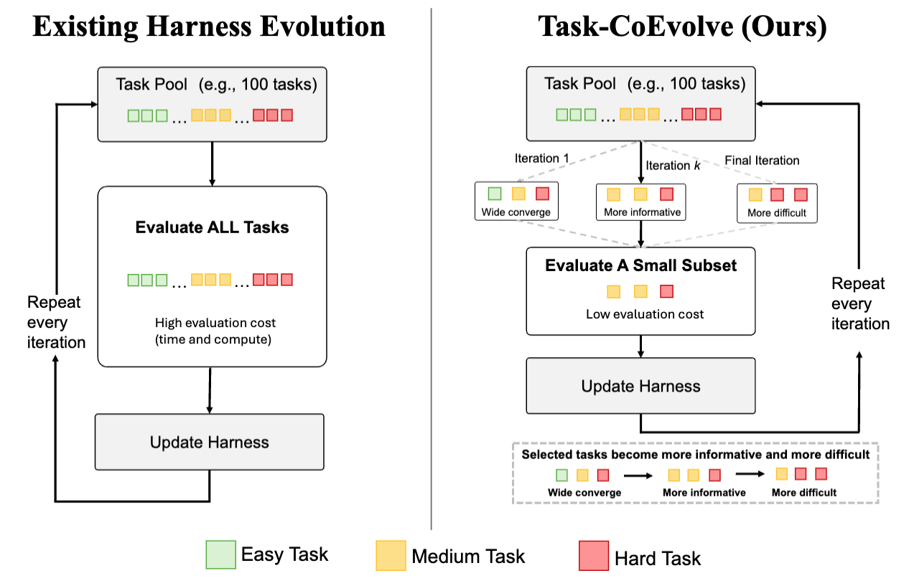

# Task-CoEvolve: Efficient Harness Optimization via Adaptive Validation Task Selection

[Atsuyuki Miyai](https://atsumiyai.github.io/), [Toshihiko Yamasaki](https://scholar.google.com/citations?user=rE9iY5MAAAAJ&hl=ja), [Kiyoharu Aizawa](https://sites.google.com/view/aizawa-kiyoharu)
The University of Tokyo

---

<p align="center">
  
</p>

## TL;DR

> **Same performance as full-set harness optimization, with 80% fewer evaluations.**
>
> Task-CoEvolve co-evolves the validation task set with the harness: it focuses evaluation on tasks where candidate harnesses disagree, and corrects the resulting estimates so scores stay comparable across iterations. On online text classification and Terminal-Bench 2.1, it **matches the final performance of full-set search while cutting the evaluation budget during optimization by 80%**, and consistently outperforms fixed-subset baselines at the same budget.

## Abstract

We present a novel approach to efficient LLM agent harness optimization through
adaptive validation task selection. Harness optimization iteratively rewrites the
harness code based on validation performance, enabling substantial performance
gains without updating the underlying model weights. Existing approaches, however,
evaluate a fixed validation set in full at every iteration, incurring substantial
evaluation costs even on tasks that become less discriminative as the harness
evolves.

We propose **Task-CoEvolve**, which *co-evolves* the validation tasks with the
harness by addressing two challenges: selecting informative tasks and estimating
full-set performance from partial evaluations. Task-CoEvolve builds on the
observation that tasks on which candidate harnesses disagree are more informative
for distinguishing among them than tasks that are consistently solved or failed.
It uses variance-weighted sampling based on past outcomes to focus evaluation on
tasks near the agent's capability frontier, with the sampling distribution
adapting as the harness evolves. It then estimates full-set scores from the
sampled tasks by accounting for their sampling probabilities, enabling consistent
comparisons across iterations despite evaluating different subsets.

Experiments on online text classification and Terminal-Bench 2.1 show that
Task-CoEvolve consistently outperforms fixed-subset baselines and matches the
final performance of full-set search while reducing the number of evaluations
during optimization by 80%.

## Code

**Code will be available soon.** Please watch 👀 this repository to get notified when it is released.

## Citation

```bibtex
@article{miyai2026taskcoevolve,
  title   = {Task-CoEvolve: Efficient Harness Optimization via Adaptive Validation Task Selection},
  author  = {Miyai, Atsuyuki and Yamasaki, Toshihiko and Aizawa, Kiyoharu},
  journal = {arXiv preprint},
  year    = {2026}
}
```

## Related Work from Our Group

**[Jr. AI Scientist and Its Risk Report](https://arxiv.org/abs/2511.04583)** — This paper comprehensively discusses the capability limitations of current state-of-the-art AI Scientists and their associated risks, which helps clarify the direction of our future work.

```bibtex
@article{miyai2026jr,
  title   = {Jr. AI Scientist and Its Risk Report: Autonomous Scientific Exploration from a Baseline Paper},
  author  = {Miyai, Atsuyuki and Toyooka, Mashiro and Otonari, Takashi and Zhao, Zaiying and Aizawa, Kiyoharu},
  journal = {TMLR},
  year    = {2026}
}
```

**[Paper Reconstruction Evaluation (PaperRecon)](https://arxiv.org/abs/2604.01128)** — This paper introduces the first systematic evaluation framework for quantifying the quality and risks of papers written by modern coding agents. In PaperRecon, an overview is created from an existing paper, after which an agent generates a full paper based on the overview and minimal additional resources, and the result is subsequently compared against the original paper.

```bibtex
@article{miyai2026paper,
  title   = {Paper Reconstruction Evaluation: Evaluating Presentation and Hallucination in AI-written Papers},
  author  = {Miyai, Atsuyuki and Toyooka, Mashiro and Zhao, Zaiying and Watanabe, Kenta and Yamasaki, Toshihiko and Aizawa, Kiyoharu},
  journal = {arXiv preprint arXiv:2604.01128},
  year    = {2026}
}
```
